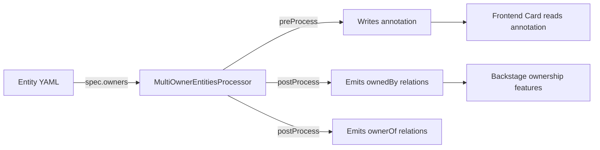

# @thecodingsheikh/backstage-plugin-catalog-backend-module-multi-owner-processor

A backend module for the Backstage catalog that processes `spec.owners` on entities and emits proper `ownedBy` / `ownerOf` relations for each owner.


## Features

- Reads `spec.owners` (an array of strings or `{ name, role }` objects) from any entity
- Emits bidirectional `ownedBy` / `ownerOf` relations for each owner
- Writes a normalized `multi-owner.io/owners` annotation (JSON) for the frontend to consume
- Coexists with the built-in `spec.owner` field — both are merged automatically
- Defaults unqualified references to `kind: Group`

## Installation

```bash
yarn --cwd packages/backend @thecodingsheikh/backstage-plugin-catalog-backend-module-multi-owner-processor
```

### Backend Setup

In your `packages/backend/src/index.ts`:

```ts
const backend = createBackend();

// ... other plugins ...

// Multi-owner processor
backend.add(
  import(
    '@thecodingsheikh/backstage-plugin-catalog-backend-module-multi-owner-processor'
  ),
);

backend.start();
```

## Entity Configuration

Add `spec.owners` to any entity's `catalog-info.yaml`:

```yaml
apiVersion: backstage.io/v1alpha1
kind: Component
metadata:
  name: my-service
spec:
  type: service
  lifecycle: production
  owners:
    - name: group:default/platform-team
      role: maintainer
    - name: group:default/sre-team
      role: operations
    - name: user:default/jane
      role: tech-lead
    - group:default/qa-team  # string shorthand, no role
```

## How It Works


