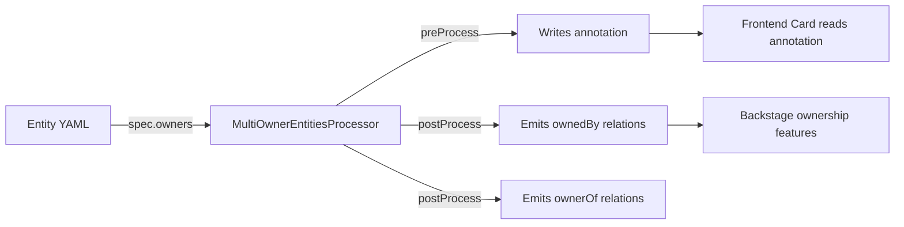

# @thecodingsheikh/backstage-plugin-catalog-backend-module-multi-owner-processor

A backend module for the Backstage catalog that processes `spec.owners` on entities and emits proper `ownedBy` / `ownerOf` relations for each owner.


## Features

- Reads `spec.owners` (an array of strings or `{ name, role }` objects) from any entity
- Emits bidirectional `ownedBy` / `ownerOf` relations for each owner
- Writes a normalized `multi-owner.io/owners` annotation (JSON) for the frontend to consume
- Coexists with the built-in `spec.owner` field — both are merged automatically
- Defaults unqualified references to `kind: Group`
- Registers two catalog permission rules that understand `role` on owners — see [Permission rules](#permission-rules)

## Installation

```bash
yarn --cwd packages/backend @thecodingsheikh/backstage-plugin-catalog-backend-module-multi-owner-processor
```

### Backend Setup

In your `packages/backend/src/index.ts`:

```ts
const backend = createBackend();

// ... other plugins ...

// Multi-owner processor
backend.add(
  import(
    '@thecodingsheikh/backstage-plugin-catalog-backend-module-multi-owner-processor'
  ),
);

backend.start();
```

## Entity Configuration

Add `spec.owners` to any entity's `catalog-info.yaml`:

```yaml
apiVersion: backstage.io/v1alpha1
kind: Component
metadata:
  name: my-service
spec:
  type: service
  lifecycle: production
  owners:
    - name: group:default/platform-team
      role: maintainer
    - name: group:default/sre-team
      role: operations
    - name: user:default/jane
      role: tech-lead
    - group:default/qa-team  # string shorthand, no role
```

## How It Works


```mermaid
graph LR
    A[Entity YAML] -->|spec.owners| B[MultiOwnerEntitiesProcessor]
    B -->|preProcess| C[Writes annotation]
    B -->|postProcess| D[Emits ownedBy relations]
    B -->|postProcess| E[Emits ownerOf relations]
    C --> F[Frontend Card reads annotation]
    D --> G[Backstage ownership features]
```

## Permission rules

The built-in `IS_ENTITY_OWNER` rule tells you _"is this user in `relations.ownedBy`"_ — it doesn't look at the `role` field on multi-owner entries. This module adds two role-aware catalog permission rules that plug directly into the Backstage [Permission Framework](https://backstage.io/docs/permissions/overview), so you can write policies like _"only owners with `role: admin` may edit this entity"_.

Rules are registered automatically when the module is installed. Reference them by name (the strings below) in your `conditional-policies.yaml` (e.g. via the RHDH RBAC plugin).

### `IS_ENTITY_MULTI_OWNER_WITH_ROLE`

Allows entities where the subject appears in `spec.owners` with a role contained in a policy-supplied allowlist.

| Param | Type | Meaning |
|-------|------|---------|
| `claims` | `string[]` | Entity refs identifying the subject. Typically `["$ownerRefs"]` for the current user's group + user refs. |
| `roles` | `string[]` | Roles on `spec.owners` entries that are allowed to match. |

Owners declared as plain-string shorthand (no `role`) never match this rule.

```yaml
# Only owners with role "admin" may update this kind of resource
conditions:
  rule: IS_ENTITY_MULTI_OWNER_WITH_ROLE
  resourceType: catalog-entity
  params:
    claims: ["$ownerRefs"]
    roles: ["admin"]
```

### `IS_ENTITY_MULTI_OWNER_WITH_ANNOTATION_ROLE`

Like the above, but reads the allowlist of roles from a per-entity annotation whose value is a comma-separated list. Returns `false` when the annotation is absent — compose with `HAS_ANNOTATION` / `not` in your policy if you want a fallback branch.

| Param | Type | Meaning |
|-------|------|---------|
| `claims` | `string[]` | Same as above. |
| `annotation` | `string` | Annotation name whose value lists the allowed roles (CSV). |

```yaml
# Per-entity role check driven by the scaffolder-edit-roles annotation
conditions:
  anyOf:
    # No annotation → fall back to plain owner check
    - allOf:
        - not:
            rule: HAS_ANNOTATION
            resourceType: catalog-entity
            params: { annotation: backstage.io/scaffolder-edit-roles }
        - rule: IS_ENTITY_OWNER
          resourceType: catalog-entity
          params: { claims: ["$ownerRefs"] }
    # Annotation present → only owners whose role matches
    - rule: IS_ENTITY_MULTI_OWNER_WITH_ANNOTATION_ROLE
      resourceType: catalog-entity
      params:
        claims: ["$ownerRefs"]
        annotation: backstage.io/scaffolder-edit-roles
```

Pair this with any `catalog-entity` resource permission — for example `entity-scaffolder.edit` from [`@thecodingsheikh/backstage-plugin-entity-scaffolder`](https://github.com/TheCodingSheikh/backstage-plugins/blob/main/plugins/entity-scaffolder/entity-scaffolder/README.md), `catalog.entity.read`, `catalog.entity.update`, etc.

### Notes on `toQuery`

Both rules emit a `toQuery` filter that narrows the catalog DB query to entities the user already owns (`relations.ownedBy` index). The role refinement is then applied in-memory. This means list endpoints stay efficient while single-resource authorization remains correct.
